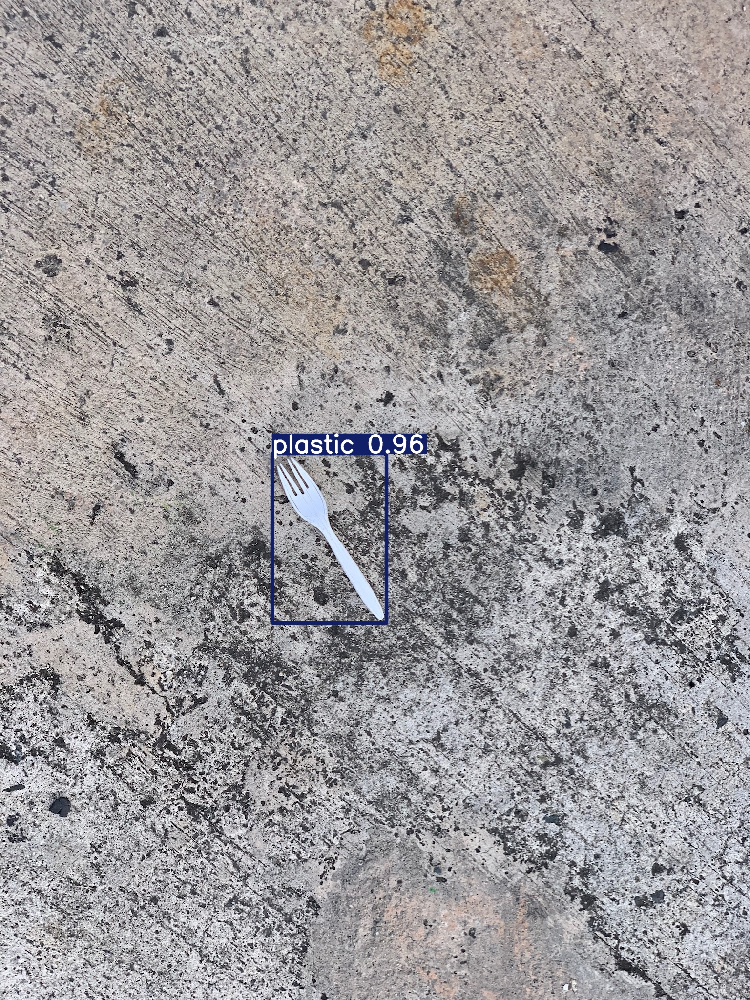

# ♻️ YOLOv10 Waste Detection

YOLOv10 waste detection (5 classes) - baseline + fine-tuned models on TACO dataset subset.

## 🎯 Problem Statement

Waste classification in real-world environments with varying lighting, occlusion, and background noise.

## 📊 Dataset

- **Source:** TACO Dataset (curated subset)
- **Size:** 1,400 images
- **Classes:** plastic, paper, metal, glass, organic
- **Split:** 70% train / 20% val / 10% test
- **Format:** YOLO (640×640)

## 🚀 Quick Start

### Installation
```bash
git clone https://github.com/hadysadya/yolov10-waste-detection.git
cd yolov10-waste-detection
pip install ultralytics
```

### Inference
```bash
yolo task=detect mode=predict \
  model=models/finetuned_best.pt \
  source=path/to/image.jpg \
  conf=0.25
```

### Training
Full training pipeline available in notebooks:
- [Baseline Training](notebook/v1_baseline.ipynb)
- [Fine-tuning](notebook/v2_finetune.ipynb)

## 📈 Results

| Version | Dataset | Precision | Recall | mAP@50 | mAP@50-95 |
|---------|---------|-----------|--------|--------|-----------|
| Baseline | 500 | 0.432 | 0.294 | 0.317 | 0.240 |
| Fine-tuned | 1,400 | 0.545 | 0.421 | 0.469 | 0.344 |

### Training Curves


### Inference Example


## 🗂️ Model Weights

- **Baseline:** `models/baseline_best.pt` (16MB)
- **Fine-tuned:** `models/finetuned_best.pt` (16MB)

## 🛠️ Tech Stack
- **Model:** YOLOv10s
- **Framework:** Ultralytics
- **Hardware:** NVIDIA Tesla T4 (Google Colab)

## 🔮 Future Work

- Improve organic waste detection with targeted augmentation
- Hyperparameter tuning for better recall
- Deploy as REST API for mobile/web integration
